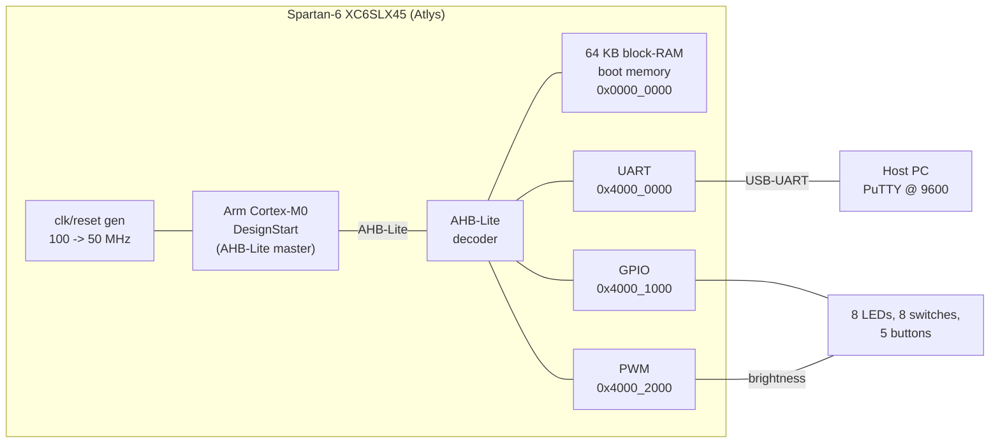
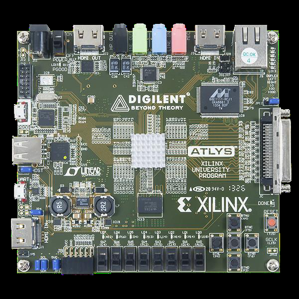
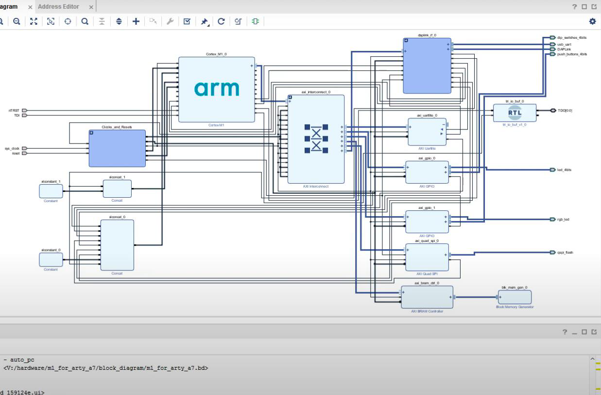
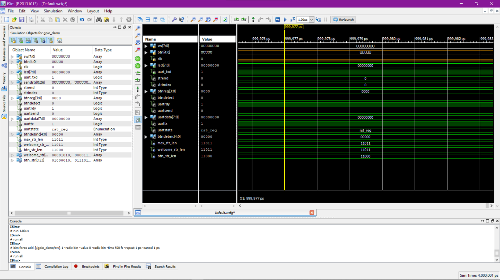

# ARM Cortex-M0 DesignStart on FPGA (Digilent Atlys / Spartan-6)

A complete small SoC built around the **Arm Cortex-M0 DesignStart** soft
processor, ported to a **Digilent Atlys** board (Xilinx **Spartan-6 XC6SLX45**)
and driving an interactive **GPIO/UART demonstrator**: an LED-pattern and
PWM demo controlled from a serial console and the board's buttons and switches.

Originally developed in 2022 as an M.Tech (Embedded Systems) project at Nirma
University; this repository is a cleaned-up, fully documented reconstruction of
that work with modern engineering practice applied throughout — verified
testbenches, host-side unit tests, CI, and reproducible builds.

[](../../actions)
[](LICENSE)

---

## What it does

After configuring the FPGA and connecting a 9600 8N1 terminal (PuTTY) to the
Atlys USB-UART port, the firmware prints a task menu:

```
****************************************************
**  Cortex-M0 DesignStart on Digilent Atlys       **
**  LEDs and switches GPIO demonstration          **
****************************************************
Choose Task:
BTN0: Print PWM value.
BTN1: 'Cylon' LED display.
BTN2: Scrolling LED display.
BTN3: Return to this menu.
```

- **BTN0** reads the slide switches into the PWM duty register and prints the
  value over UART.
- **BTN1** runs a "Cylon" animation — one lit LED bounces end-to-end across
  the 8 user LEDs.
- **BTN2** runs a scrolling animation — the lit LED walks across and wraps.
- **BTN3** stops the running task and returns to the menu.

## System architecture



Full details: [docs/architecture.md](docs/architecture.md) ·
[docs/memory-map.md](docs/memory-map.md) ·
[docs/hardware.md](docs/hardware.md)

## Gallery

The Atlys board running the demonstrator, and the design in Vivado / simulation
(all from the original 2022 project):

| | |
|---|---|
|  |  |
| The Digilent Atlys (Spartan-6 XC6SLX45) | Running on hardware: LEDs lit, button press over UART |
|  |  |
| Vivado IP Integrator: Arm core + peripheral fabric | ISim GPIO simulation waveform |

More, with provenance notes: [docs/images/README.md](docs/images/README.md).

## Repository layout

```
rtl/soc/            SoC top level, AHB-Lite decoder, boot memory, clk/reset
rtl/peripherals/    UART, GPIO (debounced), PWM  -- VHDL AHB-Lite slaves
firmware/           Bare-metal C demonstrator, startup, linker script
firmware/test/      Host-side Unity unit tests for the pattern logic
sim/testbenches/    Self-checking VHDL testbenches + CPU simulation stub
sim/scripts/        One-command test runner (GHDL)
constraints/        Atlys pin/timing constraints (ISE .ucf)
scripts/            bin2hex.py (firmware image -> VHDL memory init)
third_party/        Placeholder for the Arm DesignStart core (NOT included)
docs/               Architecture, hardware, build, usage documentation
```

## Important: the Arm core is not included

The Cortex-M0 DesignStart RTL is Arm-licensed IP and **cannot be
redistributed**, so it is not in this repository. Everything else — the SoC
fabric, all three peripherals, firmware, testbenches, constraints — is
original work under MIT. To build the full bitstream you must download
DesignStart from Arm (free registration) and drop it into
`third_party/arm_cortex_m0_designstart/`.
Instructions: [third_party/arm_cortex_m0_designstart/README.md](third_party/arm_cortex_m0_designstart/README.md).

Everything *except* the final bitstream works without the Arm core: the
peripheral testbenches use a bus-transaction stub, the firmware cross-builds,
and the unit tests run on the host. CI exercises all of that on every push.

## Quick start

**Run the verification suite (no hardware, no Arm core needed):**

```bash
sudo apt-get install ghdl gcc-arm-none-eabi
./sim/scripts/run_tests.sh        # VHDL testbenches: UART, GPIO, PWM
make -C firmware/test             # Unity unit tests (7 tests)
make -C firmware                  # cross-build firmware.elf/.bin/.hex
```

**Build the bitstream and run on an Atlys:** see
[docs/build-guide.md](docs/build-guide.md) and
[docs/usage.md](docs/usage.md).

## Verification

| What                          | How                                            | Status |
|-------------------------------|------------------------------------------------|--------|
| UART TX framing               | Bit-level decode of serial waveform in TB      | ✅ pass |
| GPIO LED / switch / debounce  | Self-checking AHB transaction TB               | ✅ pass |
| PWM duty accuracy             | Duty measured over a full period in TB         | ✅ pass |
| Full AHB fabric (stub CPU)    | SoC smoke test: bus write reads back through fabric | ✅ pass |
| LED pattern logic             | 7 Unity unit tests on the host (exhaustive)    | ✅ pass |
| Firmware image                | Cross-builds warning-free (`-Wall -Wextra -Werror`) | ✅ pass |
| Full SoC on silicon           | Requires Arm core + Atlys board                | manual |

Testbenches and the simulation stub let the AHB fabric be exercised without
Arm IP; instruction-level execution is only verified on hardware or with the
real DesignStart core in simulation.

## Technology

**VHDL** (RTL + testbenches) · **C** (bare-metal, ARMv6-M) · **AHB-Lite** ·
Xilinx **ISE 14.7** / **Vivado** (original flow), **GHDL** (open verification
flow) · **arm-none-eabi-gcc** / Keil MDK · **Unity** test framework ·
GitHub Actions CI

## Project history and honesty notes

- The original 2022 implementation used the Cortex-M0 DesignStart core in
  Xilinx ISE on the Atlys board, with a Keil MDK firmware flow and a PuTTY
  serial console — as documented in the M.Tech project report.
- The original sources were lost; this repository is a **faithful
  reconstruction**, not the untouched originals. Where the reconstruction
  makes a choice the original may not have made (e.g. the exact UART register
  layout, the behavioural clock divider), that is stated in the docs.
- Screenshots and photos in `docs/images/` are the real captures from the
  original project, labelled by what they actually show. One report screenshot
  (a PuTTY menu that reads "Arty Evaluation Board") was deliberately omitted
  rather than mislabelled as Atlys — see `docs/images/README.md`.
- Resource-utilisation and timing numbers are intentionally **not** quoted:
  they were not preserved from the original run and will not be published
  here until re-measured. No invented benchmarks.

## Roadmap

See [docs/roadmap.md](docs/roadmap.md). Highlights: SysTick-driven delays to
replace busy-wait loops, interrupt-driven UART RX, DCM-based clocking,
Cortex-M0 co-simulation with the real core, and a port to a current 7-series
board (Arty / Nexys) since Spartan-6 and ISE are end-of-life.

## License

Original work: [MIT](LICENSE). Arm Cortex-M0 DesignStart: Arm's own licence,
not distributed here. Unity test framework: MIT (vendored, see
`firmware/test/unity/LICENSE.txt`).

## Author

**Urvish Kosta** — Embedded Systems & Digital Design Engineer
[LinkedIn](https://linkedin.com/in/urvishkosta) · kostaurvish@gmail.com
