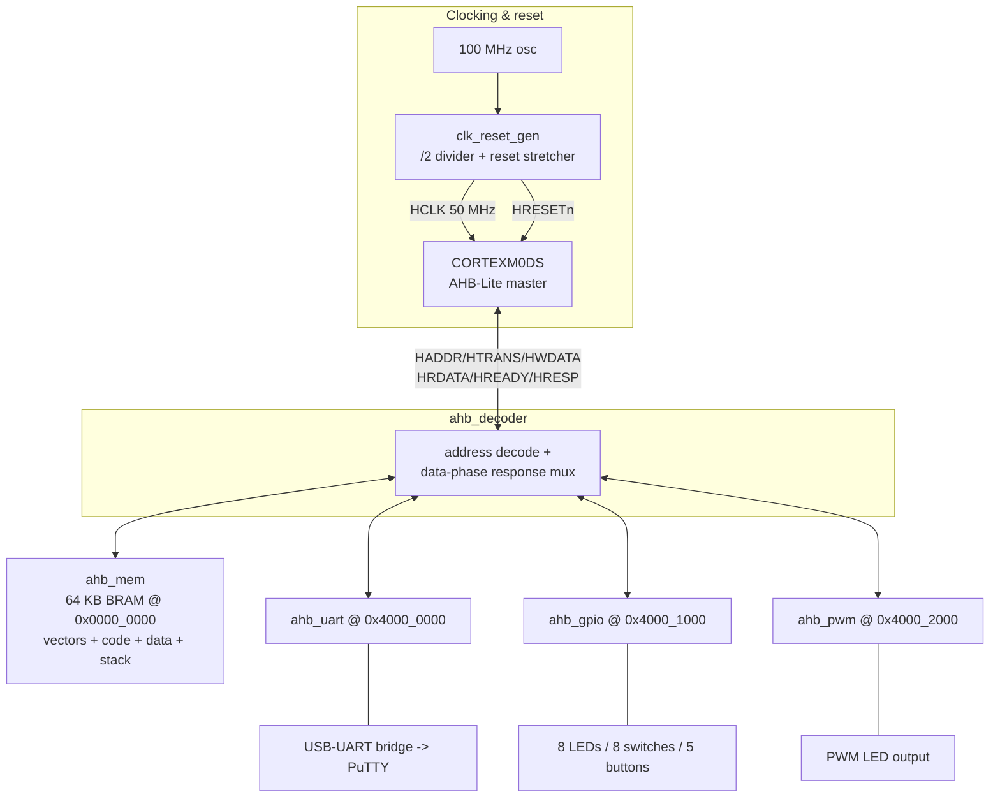
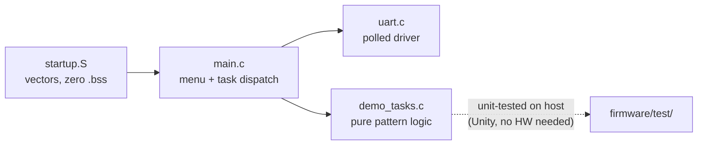
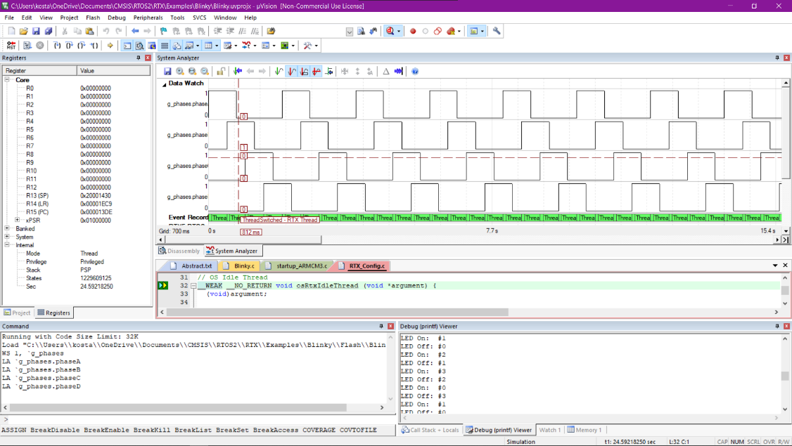

# Architecture

## Overview

The design is a minimal single-master AHB-Lite SoC. The Cortex-M0 DesignStart
core is the only bus master; four slaves hang off a combinational address
decoder. There are no interrupts in use (the DesignStart core's 16 IRQ inputs
are tied low) — all I/O is polled, which is sufficient for a human-speed
demonstrator and keeps the design easy to reason about.

## AHB-Lite protocol subset

The peripherals implement the subset of AHB-Lite that a zero-wait-state slave
needs:

- **Address phase**: when `HSEL = 1`, `HTRANS[1] = 1` and `HREADYin = 1`, the
  slave registers `HADDR`, `HWRITE`.
- **Data phase**: the following cycle. Writes consume `HWDATA`; reads present
  `HRDATA` combinationally from the registered address.
- `HREADYout` is tied high (no wait states) and `HRESP` low (OKAY only).
- Word (32-bit) access only. `HSIZE`/byte strobes are ignored — a documented
  simplification, acceptable because the firmware performs only word accesses.
- Single master, so no arbitration; `HBURST`, `HPROT`, `HMASTLOCK` unused.

The decoder additionally holds the *selected-slave index* in a register so the
read-data mux routes the correct slave during the data phase — the standard
AHB decoder/multiplexor pattern from the AMBA specification.

## Peripheral design notes

**UART (`ahb_uart.vhd`)** — 8N1, runtime-programmable divisor
(`BAUD = f_HCLK / baud_rate`, default 9600 @ 50 MHz = 5208). TX is a 10-bit
shift register (start, 8 data LSB-first, stop) paced by a down-counter; a bit
lasts exactly `divisor` cycles. RX uses a 2-flop synchroniser, detects the
start edge, waits half a bit to sample mid-bit, then samples each data bit.
Reading `DATA` clears the RX-ready flag.

**GPIO (`ahb_gpio.vhd`)** — LED output register, synchronised switch inputs,
and counter-debounced buttons (~10 ms at 50 MHz, generic-configurable so the
testbench can shrink it). Debouncing in hardware keeps the firmware's
"one press = one action" logic trivial.

**PWM (`ahb_pwm.vhd`)** — free-running 8-bit counter compared against `DUTY`;
at 50 MHz the PWM period is 256 cycles ≈ 195 kHz, far above flicker.

**Boot memory (`ahb_mem.vhd`)** — 64 KB inferred block RAM initialised from
`firmware.hex` (one 32-bit word per line, produced by `scripts/bin2hex.py`).
The Cortex-M0 fetches its initial SP from `0x0` and reset vector from `0x4`,
so the image is linked to start at `0x0000_0000` (see `firmware/link.ld`).
Code, data and stack all live in this one RAM — no copy loop needed at boot.

## Clocking

The Atlys provides 100 MHz; the SoC runs at 50 MHz. The checked-in
`clk_reset_gen.vhd` uses a behavioural divide-by-two so the whole design
simulates with open tools. **For synthesis, prefer a Spartan-6 `DCM_SP` or
PLL primitive** (dedicated clock routing, defined phase): instantiate
`DCM_SP` with `CLKFX_DIVIDE`/`CLKFX_MULTIPLY` for 50 MHz and feed its output
to `HCLK` in place of the divider output. This swap is a one-file change and
is called out in the roadmap.

## Firmware structure

The LED animations are **pure functions** over explicit state structs —
`cylon_step()` and `scroll_step()` take state, return the next 8-bit pattern,
and never touch a register. `main.c` owns all hardware access and timing.
This split is what makes the Unity tests meaningful: the entire animation
behaviour (bounce, wrap, one-hot invariant, 14-step Cylon period) is verified
exhaustively on the host before the FPGA is ever configured.

Firmware-side simulation in Keil MDK from the original project:

## Design decisions and trade-offs

| Decision | Rationale | Trade-off |
|---|---|---|
| Polled I/O, no interrupts | Human-speed demo; simplest correct design | CPU spins in delays; roadmap: SysTick |
| Word-only AHB slaves | Firmware only does word accesses | Byte writes to peripherals unsupported |
| Zero-wait-state slaves | All slaves respond in one cycle at 50 MHz | Ties HREADY high; must revisit if a slow slave is added |
| One 64 KB RAM for everything | No flash controller needed; simple linker script | Image lost on power cycle (matches original project's documented behaviour) |
| Behavioural clock divider in repo | Vendor-neutral, GHDL-simulatable | DCM recommended for real timing closure |
| Pure-logic animation functions | Host-testable without hardware | Slightly more plumbing in main.c |
