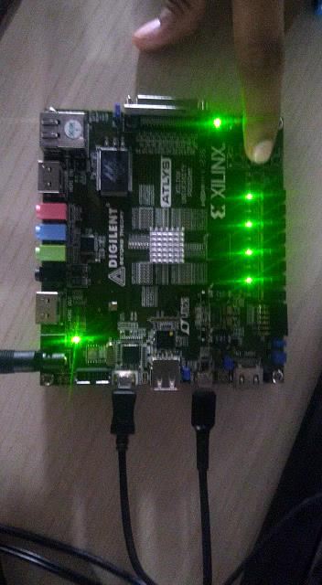

# Usage

## Setup

1. Program the bitstream into the Atlys with Digilent Adept
   (see [build-guide.md](build-guide.md)).
2. Connect the **UART** micro-USB port to the host. A COM port appears
   (e.g. `COM5` on Windows, `/dev/ttyUSB0` on Linux).
3. Open a terminal at **9600 baud, 8N1, no flow control** (PuTTY, minicom,
   `screen /dev/ttyUSB0 9600`).
4. Press the reset button (BTNU). The menu prints:

```
****************************************************
**  Cortex-M0 DesignStart on Digilent Atlys       **
**  LEDs and switches GPIO demonstration          **
****************************************************
Choose Task:
BTN0: Print PWM value.
BTN1: 'Cylon' LED display.
BTN2: Scrolling LED display.
BTN3: Return to this menu.
```

> The design running on the Atlys, with a button press registering over the
> serial console:
>
> 
>
> *(The original report's task-menu PuTTY capture came from an Arty-based
> example and is not reproduced here — see docs/images/README.md. Capture a
> fresh Atlys menu screenshot when next run.)*

## Tasks

**BTN0 — print PWM value.** Set the 8 slide switches to any value; press BTN0
(physical BTND). The switch value is loaded into the PWM duty register and
printed, e.g. `PWM value: 170` for switches = `10101010`. The PMOD JA1 output
(and any LED wired to it) changes brightness accordingly.

**BTN1 — Cylon.** A single lit LED sweeps LD0→LD7→LD0 continuously, one step
every ~100 ms. Press BTN3 (BTNC) to stop and return to the menu.

**BTN2 — scrolling.** The lit LED walks LD0→LD7 and wraps around. BTN3 stops
it.

**BTN3 — menu.** Stops any running task, clears the LEDs, reprints the menu.

## Changing the baud rate

The UART divisor register is runtime-writable (`BAUD` at `0x4000_0008`,
divisor = 50 000 000 / baud). To change the default, edit `DEFAULT_BAUD` in
`firmware/include/soc_regs.h` and rebuild, or change the `BAUD_RATE` generic
on `cm0ds_top` for the hardware default.

## Known behaviour

- Configuration is volatile: power-cycling the board erases the design unless
  the bitstream was written to SPI flash (see [hardware.md](hardware.md)).
- Animation timing uses a calibrated busy-wait, not a hardware timer; step
  period is approximate (~100 ms). Precise timing is on the roadmap (SysTick).
